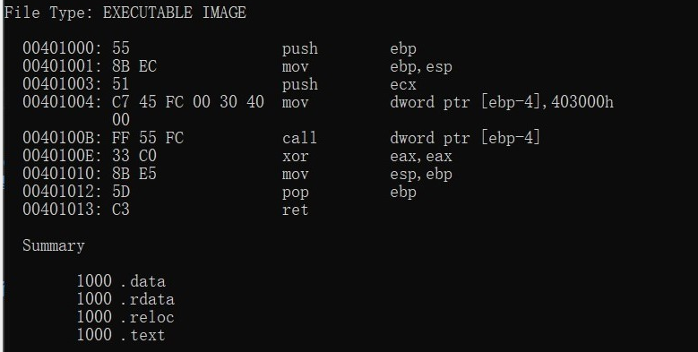

# 逆向工程与软件安全实验一

## 实验要求
- [x]把老师所给链接中shellcode能够成功运行
- [x]能从汇编源码编译通过并成功dump
- [x]自行查阅资料，搜索Windows PEB结构体，PE文件导入表导出表相关数据结构的文档，解读shellcode原理
- [x]修改shellcode功能为运行记事本程序notepad. exe
- 修改shellcode功能为下载执行器，即下下载一个可执行文件，然后再运行

## 实验过程

### 1.把老师所给链接中shellcode能够成功运行
新建项目，在源文件中创建.c文件，并在项目属性 -- 连接器 -- 高级 -- 数据执行保护（DEP）勾选否。
在.c文件中复制,编译，调试执行代码。
代码展示：

执行成果如下：

### 2.能从汇编源码编译通过并成功dump

对原项目进行编译与链接：

进行dumpbin操作：

### 3.自行查阅资料，搜索Windows PEB结构体，PE文件导入表导出表相关数据结构的文档，解读shellcode原理
#### 个人总结，如有错误劳烦老师指正。
- Shellcode是一段代码（也可以是填充数据），是用来发送到服务器利用特定漏洞的代码，一般可以获取权限。另外，Shellcode一般是作为数据发送给受攻击服务的。 Shellcode是溢出程序和蠕虫病毒的核心，提到它自然就会和漏洞联想在一起，而对打有相关补丁的主机来说shellcode的威胁完全可以消除。shellcode中往往定义了函数指针，往往记录的一个函数的地址。当执行该函数时，会跳转改地址所指函数执行。

- 在编写shellcode过程中，我们需要使用进程环境块（PEB）与PE文件PEB是一个位于所有进程内存中固定位置的结构体。此结构体包含关于进程的有用信息，如可执行文件加载到内存的位置，模块列表（DLL），指示进程是否被调试的标志，还有许多其他的信息。我们可以使用PEB结构体查找到dll加载到内存中的位置。具体过程中我们需要：
1.读取PEB结构 
2.跳转到0xC偏移处读取Ldr指针 
3.跳转到0x14偏移处读取 InMemoryOrderModuleList字段
- InInitializationOrderModuleList按照顺序保存进程加载的模块基址,其中第一个始终为ntdll.dll,第二个视系统的不同可能保存有Kernel32.dll或KernelBase.dll的信息。不管Kernel32.dll或KernelBase.dll都导出有我们需要的函数GetprocAddress和LoadLibraryEx，而LoadLibrary只在Kernel32.dll导出。
- 在pe文件中我们需要关注了解dos头中的e_lfanew 这个字段位于0x3C偏移处，它指出了PE头所的位置。PE头中的OptionalHeader（可选头）是一个包含更多有用信息的结构体，它包含DataDirectory,而该字段时由 IMAGE_DATA_DIRECTORY 元素组成的数组。 IMAGE_DATA_DIRECTORY结构包含virtualadress，我们只需跟随这个结构的 VirtualAddress字段，它指向导出目录的开始位置。再导出目录中通过函数地址=AddressOfFunctions[ 序号(函数名称) ]便可获得我们所需要调用的函数地址。

### 4.修改shellcode功能为运行记事本程序notepad. exe

参照老师的代码，修改字符串“calc.exe”为“notepad.exe”，其他不变。需要注意数据信息逆序入栈输入“exe.dapeton”并且将字符串每4个字符分为一组用ASCII对应值代替，不足的地方就用0x00来代替。
修改如下图：

再依次执行下述命令得到机械指令
- `nasm -f win32 notepad.asm -o notepad.o`
- `for i in $(objdump -D notepad.o | grep "^ " | cut -f2); do echo -n '\x'$i; done; echo`

- 将该串代码代替原代码中的code并运行

